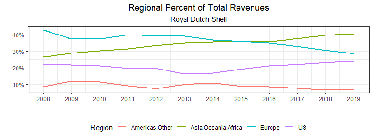
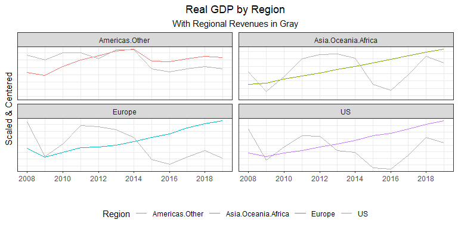
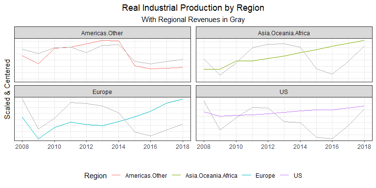
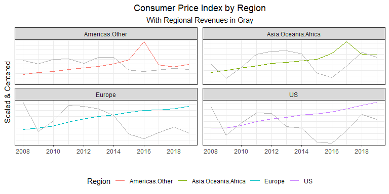
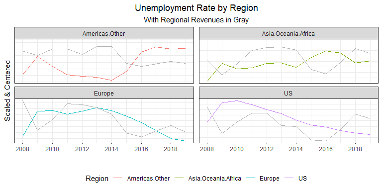
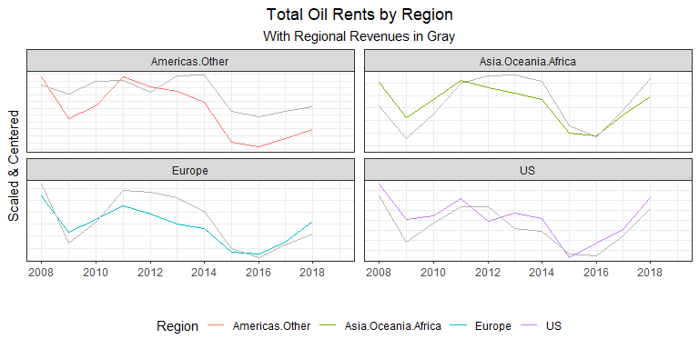

# Abstract

  Royal Dutch Shells (RDS) spans the globe receiving revenues grouped into four regions: United States, Europe, Non-US Americas, and Asia/Oceania/Africa. This study evaluates a fixed effects, log-log model to determine the elasticities of various macroeconomic indicators on annual revenues from 2004 to 2018. It is found that GDP, nominal interest rates, and exchange rates are the most impactful. However, large elasticity differences do occur between regions for exchange rates. Several recommendations are given to mitigate the risk of fluctuations between these macroeconomic variables.

# Royal Dutch Shell: A Macroeconomic Analysis

## Introduction

  Royal Dutch Shell is a international company that spans the entire globe. As such, it is subject to several macroeconomic variables throughout numerous countries. Due to COVID-19, we have seen considerable fluctuations in the macroeconomy.
  
  Over the past year, Royal Dutch Shell has dropped two places in the Fortune Global 500 and revenue declined by 11% as oil prices dropped. Adding to this, COVID-19 decreased the demand for energy leading to lowered sales. All together, profits dropped more than 33%. The past decade has not been ideal either as the average annual percent change in revenues was -0.6%. However, there was revenue growth experienced in the United States and Asia/Oceania/Africa with an annual average increase of 0.6% and 2.4%, respectively. Europe and Other Americas saw declining revenues over this period with an annual average decrease of 3.3% and 5.7%, respectively. See below for a chart of these annual revenues.
  
  Royal Dutch Shell (RDS) segments revenue streams by region. Those being the United States, Europe, Other Americas, and Asia/Oceania/Africa. In 2019, the distribution of revenues were: 24% in the US, 29% in Europe, 7% in Other Americas, and 41% in Asia/Oceania/Africa. See below for a chart of revenues by region:
  
  
 <br>
 
 

 
 <br>
 
 As evidenced in the chart above, revenue streams are subject to large deviations, moreso in some regions than others. Royal Dutch Shell is also experiencing a changing market with decreasing revenues in non-US Americas and Europe yet increasing revenues in the US and Asia/Oceania/Africa. The chart below displays how the regional percent of total revenues has changed during the period from 2008 to 2019.
 
 <br>
 

 
  As numerous macroeconomic indicators are highly correlated with revenues, such as the price of a barrel of oil, the net financial impact is exposed to these uncontrollable variables. By understanding the impacts, measures can be taken to mitigate the impact of changes to the macroeconomy. Jin and Jorian (2004) found that hedging such risks in the Oil & Natural Gas industry lowered the variation of a firm's value as measured through the stock market. Ahmed, Bhutto, and Kalhoro (2017) found real output, interest rate, inflation, and the real exchange rate too all be jointly cointegrated with the price of oil from countries in the SAARC region. 

#### Objectives

  This report will cover some major macroeconomic indicators and how they impact Royal Dutch Shell. An analysis of specific measures to mitigate this risk will be compared with the goal of maximizing revenues. By evaluating the sensitivity, or elasticity, of these indicators, Royal Dutch shell will be able to quantify the risks of a changing macroeconomy. With these elasticities, a strategy to mitigate these risks will be developed.

  The macroeconomics indicators that will be considered are changes in real GDP, consumption, industrial production, nominal interest rate, inflation, unemployment rate, exchange rate, and natural gas and oil prices. All data is retrieved from the World Bank. The national values for GDP, consumption, and industrial production within a region are summed by year to calculate the total regional values. The nominal interest rates and inflation rates are averaged for each nation using the nation's GDP as a weight. Likewise, the unemployment rate for each nation in a region is averaged using each nation's population as a weight. The exchange rate used is an index provided by the World Bank. The exchange rate for each region is set to the exchange rate for the largest national economy, as measured in GDP, in 2019.

## Method of Analysis

  By means of a log-log fixed effects model with regional revenues as the dependent variable and macroeconomics indicators as the independent variables, the elasticities of each of these indicators can be evaluated. However, given that available revenue data only traces back to 2004, this approach is severely limited in the vigor necessary for some of the claims that must be met. Therefore, a laxed approach must be considered such that the empirical results do not counter economic theory.

  We begin by visually inspecting the included macroeconomic variables with RDS revenues by region. As the exact amounts of these variables are not as important as the correlation to revenues, each of the variables for each region will be scaled and centered to give a mean of zero and standard deviation of one. By doing so, each variable may be visually analyzed in comparison to the scaled and centered revenues.


#### GDP


  Real Gross Domestic Product is monumental in the discussion of macroeconomic indicators as it is the heartbeat of an economy, measuring the total value of goods and services produced during a period. This is relevant to Royal Dutch Shell as demand for energy will fluctuate with the economy. When an economy is expanding, the energy that it needs to fulfill this expansion will increase. On the contrary, an economy will have a baseline energy requirement that must be met regardless of the growth of an economy.

  The charts below show little correlation between GDP and revenues, outside of non-US Americas. Because GDP is an all-encompassing value, the impact of more specific variables could be masking the visual impact that GDP has on revenues. 





#### Consumption

  Real Consumption is a large component of real GDP. This would reflect the actions of consumers within an economy. Higher consumption levels could lead to increased retail sales due to a populace commuting more or traveling. However, a visual analysis does not indicate much correlation, as shown below.
  


#### Industrial Production


  Industrial Production is the measure of output from manufacturing, mining, and utilities. Most of which are higher energy-consuming processes. There appears to be significant correlation to revenues in non-US Americas but little outside of this region. This could indicate differences in energy use. Economies that are more reliant on fossil fuels will have revenues more correlated to industrial production. 
  




#### Inflation


  The inflation rate, as measured by the rate of growth in the Consumer Price Index, is another instrumental macroeconomic variable. Yet it appears to correlate with revenues very little. This could be due to mostly stable inflation rates, especially when aggregated in regions, with higher inflation areas in rare pockets across the globe.
  





#### Nominal Interest Rate


  The nominal interest rate is an important variable to consider as it is the opportunity cost of holding money. Higher rates would mean that RDS is more constrained in financing projects such as research and development. This could mean that interest rates today wouldn't necessarily impact only revenues today but future revenues as some capital projects today would be foregone lowering future revenues. 

  The graph below does seem to indicate some correlation but as past interest rates could be impacting current revenues, a linear model will be a more appropriate measure of this correlation.


#### Unemployment Rate


  Another central pillar of macroeconomics, the unemployment rate will also indicate the health of an economy. RDS should expect lower revenues in regions with higher unemployment as commutes to work, lowered consumption, among other factors would lower energy demand. 

  Asia/Oceania/Africa and non-US Americas seem to follow this theory, but Europe and the US do not show much of a correlation. Again, this could be that higher-income nations are less reliant on fossil fuels which would limit the correlation between revenues and unemployment. 
  




#### Exchange Rate Index


  The exchange rate index indicates how an economy is operating relative to other economies. High-importing nations will generally reflect a higher exchange rate while high-exporting nations will generally have lower exchange rates. It will be a reflection of how local prices compare to foreign prices. 

  There does appear to be some correlation to regional revenues. The US appears to be negatively correlated with the exchange rate while non-US Americas appears to be positively correlated. 
  


#### Oil Rents


  The World Bank defines oil rents as "...the difference between the value of crude oil production at world prices and total costs of production." The data gathered was as a percent of GDP however, the chart below converts the units to dollars by multiplying each economies GDP in dollars by this percentage. This is extremely correlated to revenues, as expected. As the difference between value of production and cost of production increases, we should expect to see higher revenues. Including this variable within the linear modeling will act as a control of the volatile price of oil.





#### Natural Gas Rents


  Natural gas rents were similarly derived as oil rents. As natural gas extration and production is also a major operation at RDS, although not as major as oil, we would also expect there to be correlation with revenues. 


  A visual analysis is helpful in seeing the bilateral interactions between revenues and these macroeconomic indicators, but, due to the complexity of the market, is not sufficient to infer conclusions. Another limitation to visualizations is the possibility of spurious correlations. Using a linear model, the numerous intricacies can be quantified and help determine the most significant macroeconomic variables. A log-log model enables the evaluation of the elasticies for each of these variables to RDS revenues. Which enables the ability to determine which macroeconomic variables impact revenues the greatest. Knowing these sensitivities will indicate where to allocate resources to hedge this risk.
  

#### Log-Log model evaluation

  A fixed effects model is evaluated to determine these elasticities. An advantage of this model is the ability to estimate these elasticities while mitigating other regional factors. 
  
  


The evaluated model returns:

 <br>


```
## 
## Call:
## lm(formula = Revenue ~ gdp + consumption + indust.production + 
##     cpi + interest.nom + unemployment.rate + exchange.rate.index + 
##     Region - 1, data = indicators.diff %>% filter(!is.na(Revenue), 
##     Revenue != Inf, Year < 2019))
## 
## Residuals:
##      Min       1Q   Median       3Q      Max 
## -0.49797 -0.11368  0.01348  0.11436  0.41309 
## 
## Coefficients:
##                           Estimate Std. Error t value Pr(>|t|)  
## gdp                       11.73057    4.43901   2.643   0.0116 *
## consumption               -4.35860    4.54504  -0.959   0.3432  
## indust.production         -0.09666    1.16273  -0.083   0.9342  
## cpi                       -0.16645    0.30883  -0.539   0.5928  
## interest.nom              -2.73908    2.42250  -1.131   0.2648  
## unemployment.rate          5.95055    6.20413   0.959   0.3431  
## exchange.rate.index       -0.88245    0.63727  -1.385   0.1736  
## RegionAmericas.Other      -0.09594    0.09137  -1.050   0.2998  
## RegionAsia.Oceania.Africa -0.22989    0.11689  -1.967   0.0560 .
## RegionEurope              -0.07106    0.07025  -1.012   0.3177  
## RegionUS                  -0.11648    0.06908  -1.686   0.0994 .
## ---
## Signif. codes:  0 '***' 0.001 '**' 0.01 '*' 0.05 '.' 0.1 ' ' 1
## 
## Residual standard error: 0.2035 on 41 degrees of freedom
## Multiple R-squared:  0.4507,	Adjusted R-squared:  0.3033 
## F-statistic: 3.058 on 11 and 41 DF,  p-value: 0.004496
```

   <br>
  
  
  
  However, this model is not very robust, containing numerous variables with limited observations. Through a stepwise manner, variables with a P-value greater than .5 were removed from the model which resulted in the following equation:
  
$$
\%\Delta Revenue_{r,t} \sim \alpha_r + \beta_0*\%\Delta GDP_{r,t} + \beta_1*\Delta i_{r,t-1} + \beta_2*\Delta i_{r,t-5} + \beta_3*\%\Delta e_{r,t} + u_{r,t}
$$
 <br>


The evaluated model returns:


```
## 
## Call:
## lm(formula = Revenue ~ gdp + lag(interest.nom, n = 1) + lag(interest.nom, 
##     n = 5) + exchange.rate.index + Region - 1, data = indicators.diff %>% 
##     filter(!is.na(Revenue), Revenue != Inf, Year < 2019))
## 
## Residuals:
##      Min       1Q   Median       3Q      Max 
## -0.45077 -0.09749  0.02296  0.09375  0.32276 
## 
## Coefficients:
##                           Estimate Std. Error t value  Pr(>|t|)    
## gdp                        6.91616    1.32047   5.238 0.0000059 ***
## lag(interest.nom, n = 1)  -6.66528    2.17071  -3.071   0.00388 ** 
## lag(interest.nom, n = 5)  -5.80983    2.17730  -2.668   0.01105 *  
## exchange.rate.index       -0.92940    0.51569  -1.802   0.07924 .  
## RegionAmericas.Other      -0.16097    0.06202  -2.596   0.01324 *  
## RegionAsia.Oceania.Africa -0.21489    0.07706  -2.789   0.00814 ** 
## RegionEurope              -0.08658    0.05486  -1.578   0.12261    
## RegionUS                  -0.09707    0.05658  -1.716   0.09419 .  
## ---
## Signif. codes:  0 '***' 0.001 '**' 0.01 '*' 0.05 '.' 0.1 ' ' 1
## 
## Residual standard error: 0.1805 on 39 degrees of freedom
##   (5 observations deleted due to missingness)
## Multiple R-squared:  0.5568,	Adjusted R-squared:  0.4659 
## F-statistic: 6.125 on 8 and 39 DF,  p-value: 0.00004123
```

With the distribution of residuals:


## Results & Discussion

#### log-log model breakdown

  This model indicates that three macroeconomic variables may indicative of revenues within a region: GDP, nominal interest rate, and the exchange rate. GDP appears to have a much more immediate impact than the other two with a  coefficient of (6.92) and a statistically significant P-value. The nominal interest rate appears to be possibly more impactful but without immediate affects. The interest rate with 1 and 5 year lags are statistically significant with coefficients of -6.67 and -5.81, respectively. The exchange rate is trending significant and has a coefficient of -0.93.
  
  The Adjusted R-squared value of 0.47 indicates significant variation explanation through these variables, as 47% of all RDS revenue variances are a result of changing macroeconomic conditions. 
  
#### GDP

  The coefficient value of 6.92 for GDP means that given a 1% increase in GDP, RDS should expect revenues to increase by 6.92%. However, this sensitivity to GDP also means that RDS is just as sensitive to business cycles with increased revenues when the economy is expanding but rapidly decreasing revenues as the economy decreases. This sensitivity could be from how economies operate in a recession. In the short-term when prices are fixed and the economy begins to slow down, the Keynesian Cross indicates that this means planned expenditures/output is greater than actual output which causes inventories to increase. Firms slow down their operations which causes a reduction to demand for energy. This would mean that revenues are very sensitive to GDP because firms are not only reducing their output to match demand, but simultaneously lowering it to reduce the buildup in their inventories. However, when actual expenditures/output is greater than planned, firms see their inventories decreasing which spurs them to increase output and their demand for energy. Similar to the recession, these firms are not only increasing production to match demand but to also bring their inventory levels back to their desired levels. 
  
  It may be beneficial for RDS to stabilize the cyclic nature of revenues. Doing so will reduce the risk of default which is far more likely in economic downturns. Investments into "inferior goods" or goods whose demand increases during economic downturns would help counter the overall sensitivity of revenues to GDP. Further exploration in which product sales are most sensitive to the business cycle would be beneficial. As natural gas sold to electric utilities may not see the same fluctuations as retail gasoline sales, for example.  
  
#### Nominal Interest Rate

  Nominal interest rates have a coefficient of -6.67 lagged 1 year and -5.81 five years prior, meaning that a 1% increase in interest rates is typically associated with a 6.67 decrease in revenues the following year and a 5.81% decrease 5 years later. The nominal interest rate is directly related to the cost that RDS should expect to pay for holding or issuing debt. As interest rates rise, this results in some would-be investments to become unprofitable and for a decrease in investment expenditures. Revenues are more sensitive to interest rates lagged one year likely because an increase in rates today halts investments today that would have generated a return in the months and years to come. Further analysis would be recommended due to the nature of project selection. As the least profitable projects are foregone first, this creates a nonlinear nature of interest rates to revenues: as the interest rate increases, more and more profitable projects are forgone resulting in larger and larger decreases to revenues. 
  
  Interest rate increases will always impact investment by making some investments no longer profitable which in turn reduces revenue; however, maintaining a high credit rating will provide the lowest risk premium paid on bonds allowing for more acceptance of higher rates compared to similar companies. A transition from debtor to creditor may be useful with excess funds if the nominal rate is higher than the expected return on investment.

#### Exchange Rate

  The estimated -0.93 coefficient of the exchange rate means that a 1% increase in the exchange rate translates to a 0.93% reduction in revenues. Because the exchange rate measures relative price differences among nations, this seem like a rational value. However, upon receipt of an expanded dataset, further analysis should be evaluated to determine the country to country coefficient differences. As each country will have unique supply and demand curves for oil and gas, this figure could vary widely. Higher-income nations with more advancements in renewable technology will likely have flatter demand curves and will react more adversely to a 1% increase in price (by means of the exchange rate). Oil-producing versus non-oil-producing nations would also have a different reaction to a change in the exchange rate. Those non-oil-producing nations will be more dependent, all else equal, than oil-producing nations and wouldn't have the means to react as drastically in the short-term; whereas, oil-producing nations will have the means to shift to domestic producers. Another consideration is that, as RDS is headquartered in the Netherlands, an increase in exchange rates could increase sales in Europe as the relative price decreases compared to foreign competitors.
  
  By expanding our model above to break out the exchange rate by region, it results in the following:
  
  

```
## 
## Call:
## lm(formula = Revenue ~ Region:exchange.rate.index - 1 + gdp + 
##     lag(interest.nom, n = 1) + lag(interest.nom, n = 5) + Region, 
##     data = ., na.action = na.omit)
## 
## Residuals:
##      Min       1Q   Median       3Q      Max 
## -0.36098 -0.09939  0.01858  0.10936  0.32243 
## 
## Coefficients:
##                                               Estimate Std. Error t value
## gdp                                            6.65784    1.37070   4.857
## lag(interest.nom, n = 1)                      -4.58118    2.29247  -1.998
## lag(interest.nom, n = 5)                      -4.02186    2.16797  -1.855
## RegionAmericas.Other                          -0.12396    0.06132  -2.022
## RegionAsia.Oceania.Africa                     -0.20542    0.08662  -2.371
## RegionEurope                                  -0.08450    0.05397  -1.566
## RegionUS                                      -0.09132    0.05650  -1.616
## RegionAmericas.Other:exchange.rate.index      -0.39733    0.72061  -0.551
## RegionAsia.Oceania.Africa:exchange.rate.index -1.46768    1.25205  -1.172
## RegionEurope:exchange.rate.index               0.81332    1.79410   0.453
## RegionUS:exchange.rate.index                  -2.65901    1.19054  -2.233
##                                                Pr(>|t|)    
## gdp                                           0.0000186 ***
## lag(interest.nom, n = 1)                         0.0525 .  
## lag(interest.nom, n = 5)                         0.0710 .  
## RegionAmericas.Other                             0.0499 *  
## RegionAsia.Oceania.Africa                        0.0226 *  
## RegionEurope                                     0.1253    
## RegionUS                                         0.1139    
## RegionAmericas.Other:exchange.rate.index         0.5844    
## RegionAsia.Oceania.Africa:exchange.rate.index    0.2480    
## RegionEurope:exchange.rate.index                 0.6528    
## RegionUS:exchange.rate.index                     0.0312 *  
## ---
## Signif. codes:  0 '***' 0.001 '**' 0.01 '*' 0.05 '.' 0.1 ' ' 1
## 
## Residual standard error: 0.1798 on 40 degrees of freedom
##   (5 observations deleted due to missingness)
## Multiple R-squared:  0.5572,	Adjusted R-squared:  0.4354 
## F-statistic: 4.576 on 11 and 40 DF,  p-value: 0.0001749
```
  The "Region*******:exchange.rate.index" in the above table relates to the evaluated exchange rate elasticities for each region. As was hypothesized, lower-income regions of Asia/Oceania/Africa and non-US Americas were not nearly as sensitive to exchange rates, as can be seen by the -1.47% and -.40% elasticities, respectively. The US, a high-income and oil-producing nation, is much more sensitive to relative price differences with a -2.7% elasticity as demand for renewable energy increases as the relative price of oil/gas increase. RDS benefits when the exchange rate increases in Europe as foreign firms face an implicit price increase as indicated by the .81% elasticity. 
  
  The wide range of responsiveness to exchange rate changes call for a different action to reduce this risk. In high-income countries, a pivot towards renewable energies or other substitute goods may help to balance out the revenues when demand shifts, however, this would not directly reduce the exchange rate risk. Purchasing shell companies within the nations that are most sensitive may be beneficial if it is a means around changes to the exchange rate. In Europe, a large market share will maintain not only higher revenues, but increase the positive sensitivity to exchange rates. As citizens turn to domestic companies over foreign from exchange rate increases, having a larger percentage of the market would translate to higher revenue increases for a unit change in the exchange rate. Non-US Americas and Asia/Oceania/Africa call for similar actions but aren't as necessary as the more sensitive US. Risk reductions in these areas could also be through merger and acquisitions of domestic companies. 

## Conclusion

  Large fluctuations between numerous different macroeconomic indicators impact Royal Dutch Shell's revenues each year. Due to the complex nature of the macroeconomy, macroeconomic forecasts are not always sufficient or accurate enough to mitigate these fluctuations. Through an analysis of historical data, RDS is able to determine the most impactful variables and create strategies to reduce the sensitivities to them. By analyzing regional revenues with GDP, consumption, industrial production, inflation, nominal interest rates, unemployment rates, and exchange rates by region, it was determined that revenues are most sensitive to GDP, nominal interest rates, and then exchange rates. RDS would have the most benefit by focusing on these factors.
  
  The elasticity of GDP evaluating to 6.92 indicates revenues highly sensitive to GDP and also signifies a cointegration with the business cycle. A diversification of products may help to stabilize this high sensitivity. 
  
  Changes to the nominal interest rate also lead to revenue fluctuations by means of depressed investment. A 1% increase in interest rates would be expected to change revenues by -6.67% in the following year and -5.81% 5 years later. Mitigation measures could include high credit ratings for the lowest rates and investing excess funds when nominal rates are above the expected return on investment. 
  
  Exchange rate risk calls for a country-specific approach rather than a general approach like the others as some nations are more sensitive than others. The evaluated elasticity overall is -0.93, indicating that isolationist policies among nations on a whole have a negative impact on revenues. However, oil-producing and high-income nations are much more averse to increases while revenues from Europe increase from reduced competition. A general approach would be the acquisition of domestic companies in countries with the highest sensitivity. In Europe, an expanded market share would lead to an increased positive sensitivity and higher revenues.
  
  Another important output of the fixed effects model that stressed the importance of the matters at hand is the adjusted R-squared value of 0.47. This indicates that regardless of marketing or business expansions, 47% of RDS revenues are explained by GDP, nominal interest rates, and exchange rates across the globe. While complete de-correlation from any of these variables is impossible, measures to stabilize these fluctuations would make for more stable revenues.

  Further analysis is recommended in light of the short-comings of this analysis. An expansion of years or regions would lead to more conclusive results and would allow for the study of interaction among variables. Consideration of the marginal costs and revenues of differing investments and operations could lead to more targeted measures and determination of which activities result in the largest share of sensitivity. 
